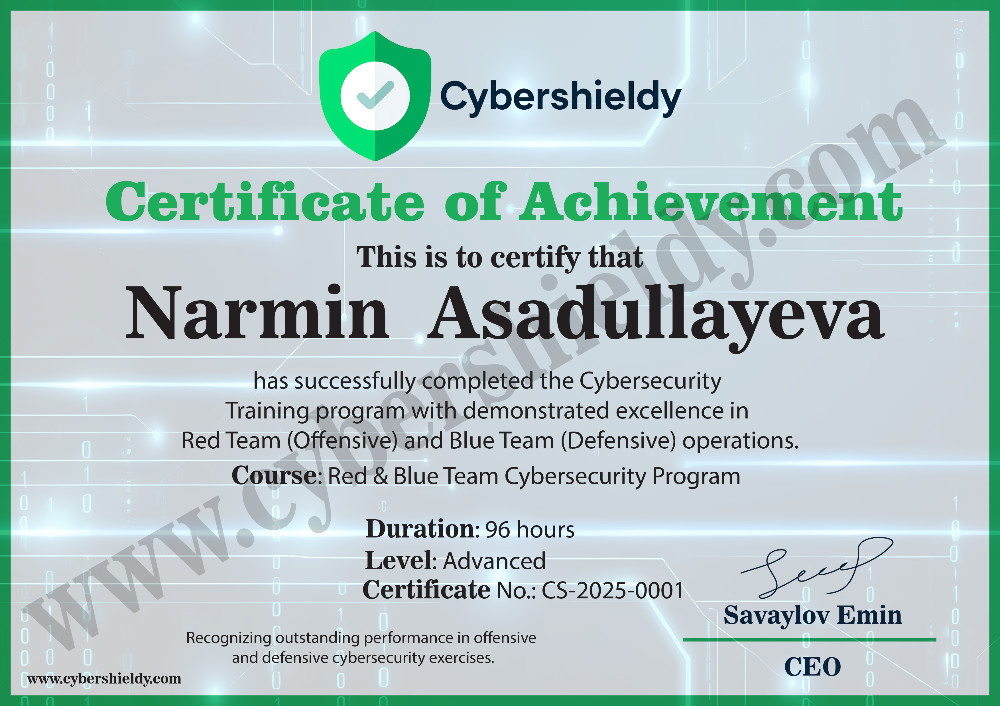

# 🌟 Nərmin Əsədullayeva - Portfolio 🌟

## 👩‍💻 Haqqımda

Mən, **Nərmin Əsədullayeva**, 4 avqust 2004-cü ildə anadan olmuşam və **Bakı şəhərində** yaşayıram. Texnologiya dünyasında özünü daim inkişaf etdirməyə və yeniliklərə imza atmağa çalışan gənc mütəxəssisəm.

📚 **Bakı Dövlət Universiteti** - Tətbiqi Riyaziyyat və Kibernetika fakültəsi  
🎓 **Kompüter Elmləri** ixtisası üzrə IV kurs tələbəsiyəm.

Kibertəhlükəsizlik sahəsindəki dərin marağım və məqsədyönlü çalışmalarımla bir çox beynəlxalq səviyyəli nailiyyətlər əldə etmişəm.

---

<!-- Burada öz profil şəklinizin URL-sini əlavə edin -->

---

## 🏅 Sertifikatlar

Aşağıda qeyd etdiyim beynəlxalq səviyyəli sertifikatları əldə etmişəm:

### 🚀 **Kibertəhlükəsizlik və Texnologiya Sertifikatları**

-   
-   
-   
-   

### 🌐 **Full Stack Web Development Sertifikatları**
-   
-   

### 🛠️ **Şəbəkə və Sistem Sertifikatları**
-   
-   
-   
-   

---

## 📍 Əlaqə

**Dil Bilikləri**:  
- 🇬🇧 **İngilis** (Sərbəst)  
- 🇷🇺 **Rus** (Sərbəst)  
- 🇹🇷 **Türk** (Sərbəst)  
- 🇦🇿 **Azərbaycan** (Ana dili)

---

## 💡 Gələcək Məqsədim

Gələcəkdə kibertəhlükəsizlik sahəsində yüksək səviyyəli ekspert olmaq və **gələcəyin etibarlı texnoloji liderlərindən biri** kimi ölkəmi beynəlxalq səviyyədə layiqincə təmsil etmək niyyətindəyəm.

---

### 🔧 Texnologiyalar və Bacarıqlar

- 🌐 **Full Stack Development**  
- 🔐 **Kibertəhlükəsizlik**  
- 🖥️ **Sistem İnfrastrukturunun Təhlükəsizliyi**  
- 📊 **Data Analysis və Big Data**  
- 🌍 **Cloud Computing (AWS, Google Cloud)**  
- ⚙️ **DevOps & CI/CD**

---

## 📈 Layihələr

1. **[Portfolio Web Page](https://link-to-your-portfolio.com)** - Əsas öz portfolio saytım, burada şəxsi layihələrimi və təcrübəmi təqdim edirəm.
2. **[CyberSecurity Awareness App](https://link-to-your-cybersecurity-app.com)** - Kibertəhlükəsizlik təlimi və testlərinə yönəlmiş mobil tətbiq layihəsi.
3. **[Full Stack Blog](https://link-to-your-fullstack-blog.com)** - React və Node.js istifadə edərək yaradılmış tamamilə işləyən bir blog platforması.

---

## 🌱 Mənimlə Əlaqə

**LinkedIn**: [linkedin.com/in/nərminəsədullayeva](https://www.linkedin.com/in/nərminəsədullayeva)  
**GitHub**: [github.com/nerminasadullayeva](https://github.com/nerminasadullayeva)  
**E-mail**: nermin@example.com

---

> **“Texnologiya insanları bir araya gətirir. Mənim məqsədim də bu dünyanı daha etibarlı və yaradıcı etməkdir.”**  
> — Nərmin Əsədullayeva
